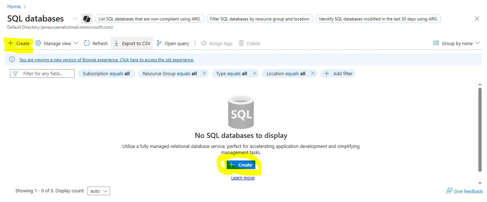
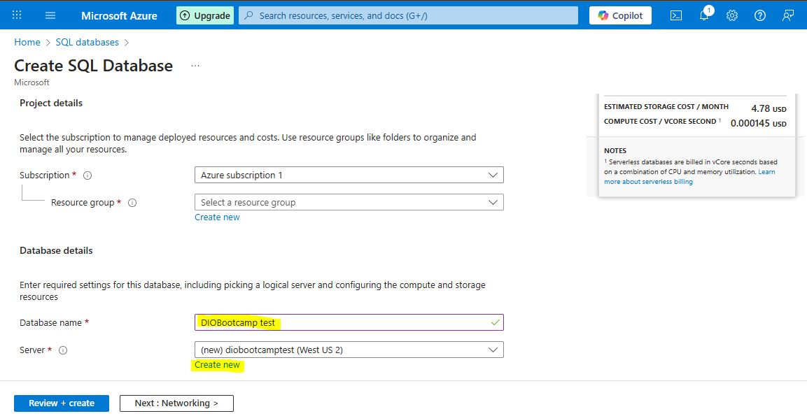
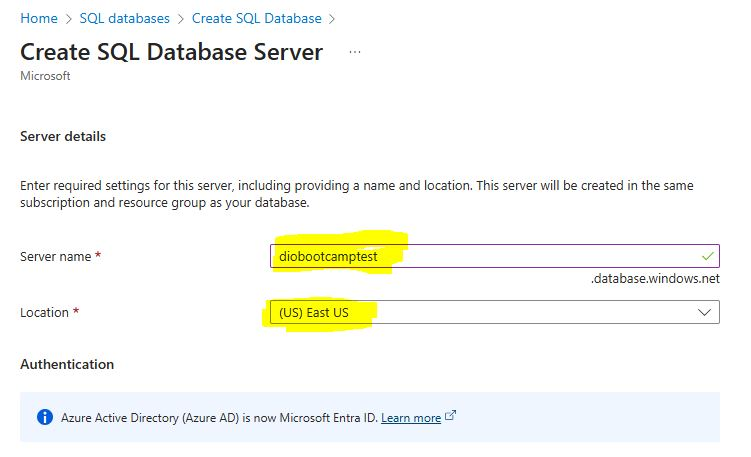
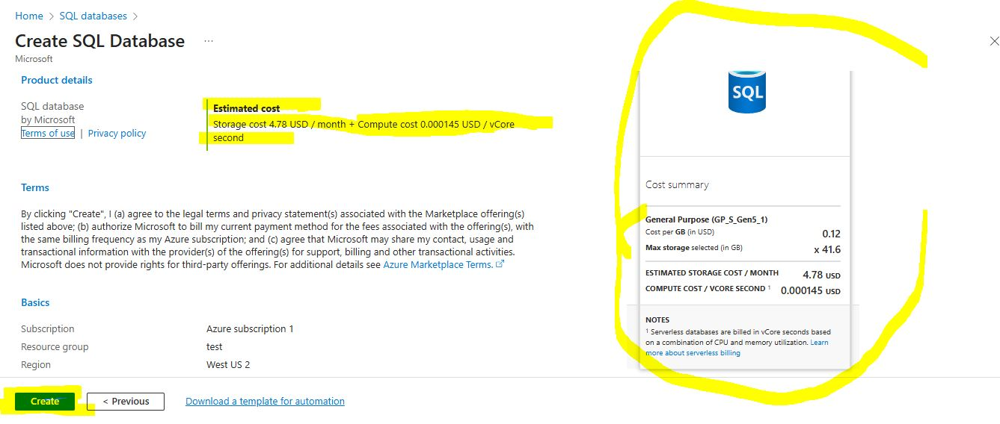

# 🚀 Desafio/Challenge DIO - Azure SQL Database

Este repositório foi desenvolvido como parte do **Desafio de Projeto da DIO** para praticar a configuração de uma instância de **Banco de Dados SQL no Microsoft Azure** e documentar a experiência.

---

## 🎯 Objetivos / Goals
- Aplicar conceitos de **Cloud Computing e Azure SQL Database**;
- Documentar processos técnicos de forma clara;
- Utilizar o **GitHub** como portfólio técnico.

---

## 📚 Passos Realizados / Step by Step
1. Logar no **Azure Portal**
2. Configurar regras do **SQL Database**
3. Conectar/criar o **Servidor**
4. Ter uma base de como funciona o **Pay as you go**

## 🖼️ Evidências (prints)

- Creating a SQL database  
  

- Creating a SQL database server (1/2)  
  

- Creating a SQL database server (2/2)  
  

- Understanding estimated cost  
  

## ✅ Resultados e Aprendizados / Learnings
- Criação e configuração de SQL database no Azure
- Documentação técnica com **Markdown** e **GitHub**
- Boas práticas de **gestão de custos** no Azure

## 🔗 Links Úteis

- [Criar uma Máquina Virtual do Windows no Azure](https://learn.microsoft.com/pt-br/azure/azure-sql/managed-instance/instance-create-quickstart?view=azuresql&tabs=azure-portal) 💻

---

## 👤 Autor
**José Amaury**  
GitHub: https://github.com/joseamaury

> 📌 *Este repositório é parte do desafio prático da DIO. 
